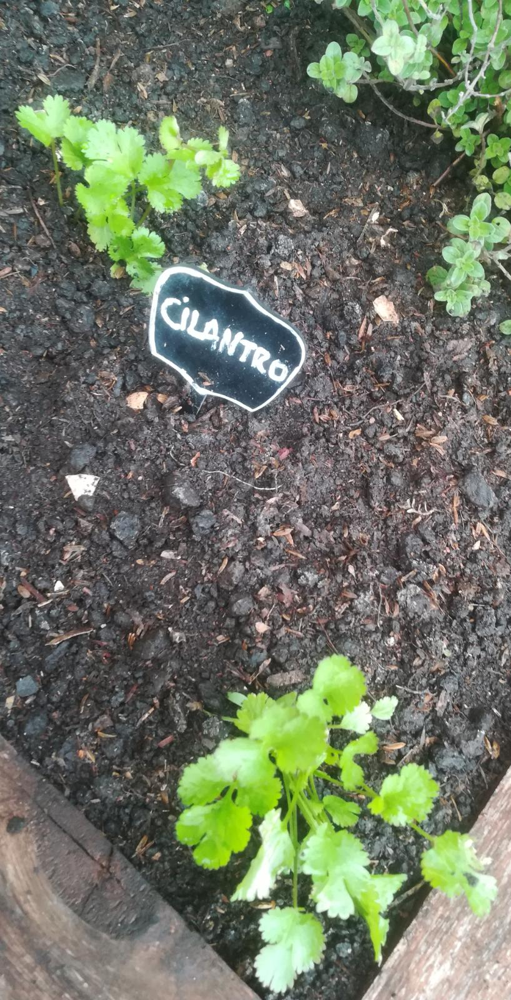

# Cilantro

## Características

*Perenne*, aromática

## Recolección

Se usan tanto las hojas como la tija.

Se debería de intentar manterner el tallo principal.

## Usos

Tiene un aroma muy freco y con un toque *picante*.

Ingrediente clave en un [ceviche](https://es.wikipedia.org/wiki/Cebiche).

Hay que ir con cuidado porque es muy intenso, y es fácil pasarse.
