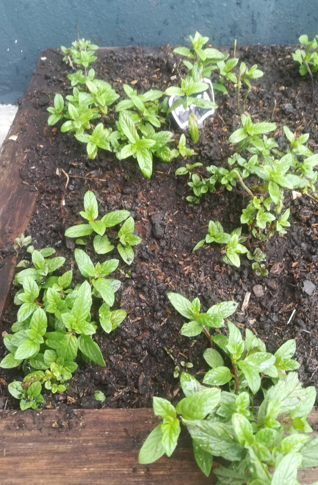

# Menta

## Características

Perenne

## Recolección

La menta es una planta invasiva, y va a crecer donde pueda,
extendiéndose por toda la maceta.

Podemos tener en cuenta eso en la recolección, intentándola mantener contenida
recogiendo de afuera hacía adentro.

## Usos

Su uso principal es como hierba aromática.

Tiene un sabor *refrescante*.

Se puede usar para aromatizar dulces (en postres por ejemplo) o incluso algunos tragos.

Para potenciar el sabor/aroma se puede machacar o triturar.
