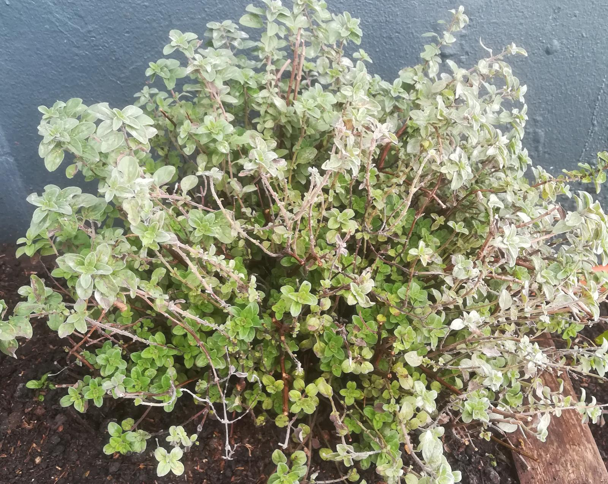

# Orégano

## Características

Perenne, aromática

## Recolección

Es interesante mantenerlo más bien arbustado, recolectando
las ramas más bajas.

## Usos

Se puede usar tanto fresco como seco.

Una forma para secarlo rápido es con un minuto de microondas.

Ideal para agregar encima de un queso como la muzzarella.

