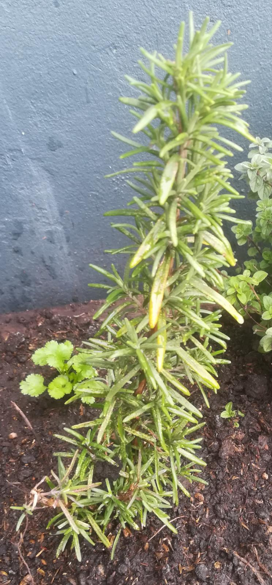

# Romero

## Características

Perenne, aromática

## Recolección

Sería bueno mantener el tronco principal e ir sacando las ramitas secundarias.

## Usos

Su olor nos recuerda a *montaña*.

Puede servir para carnes, guisos, papas al horno, etc.

Una posibilidad es saborizar un aceite de oliva con una ramita.

